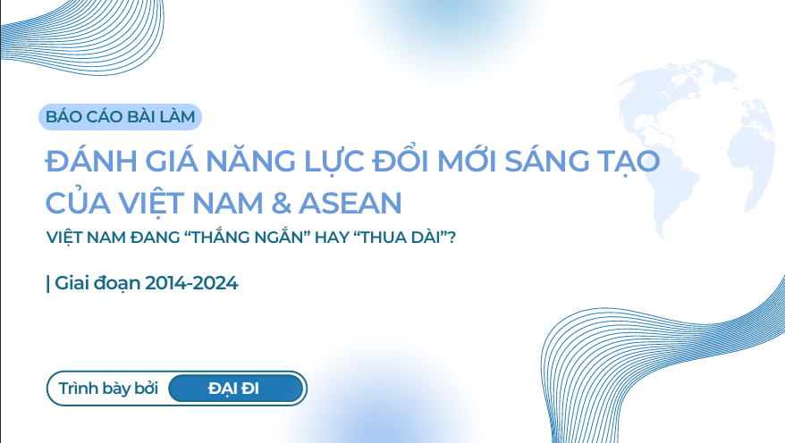
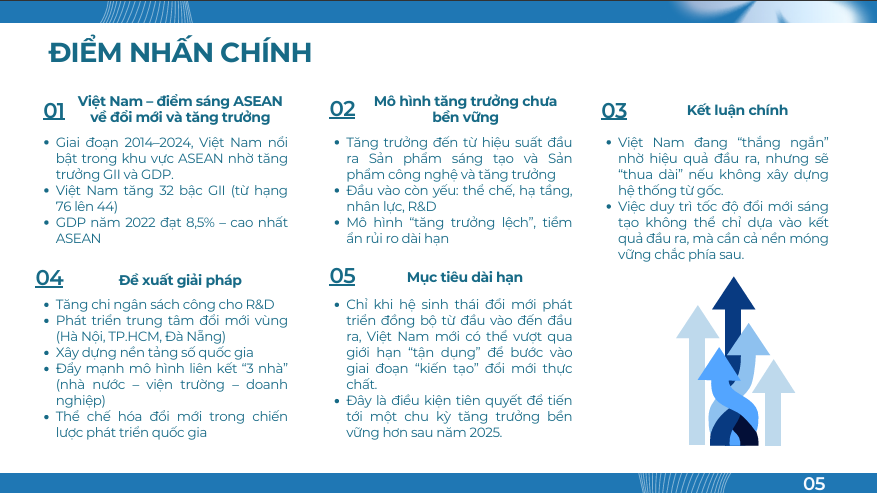
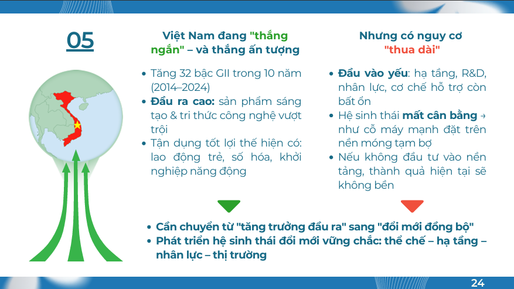

# Data Storytelling 2025 | ĐẠI ĐI Team 

Dự án này được thực hiện bởi nhóm **ĐẠI ĐI** trong khuôn khổ cuộc thi **Data Storytelling 2025**, với mục tiêu phân tích và đề xuất giải pháp dựa trên bộ dữ liệu thực tế.  
Chúng tôi đã sử dụng kỹ thuật phân tích dữ liệu, trực quan hóa, và storytelling để trình bày giải pháp một cách rõ ràng và thuyết phục.

## Thông tin cuộc thi

- **Tên cuộc thi:** Data Storytelling 2025
- **Mục tiêu nhóm:** 
+ Phân tích mối quan hệ giữa các trụ cột GII và tăng trưởng GDP tại Việt Nam trong bối cảnh ASEAN (2014–2024).
+ Đánh giá hiệu suất hệ sinh thái đổi mới sáng tạo,  xác định điểm mạnh, điểm yếu và nút thắt.
+ Đề xuất giải pháp chiến lược nhằm nâng cao năng lực đổi mới một cách đồng bộ và bền vững.

## Thành tích

Dự án này được thực hiện trong khuôn khổ cuộc thi **Data Storytelling 2025**.  
Nhóm chúng tôi đạt **Quý quân** với phần trình bày insight và trực quan hóa dữ liệu bằng Python.

## Thành phần chính trong dự án

| Tên tệp | Mô tả |
|--------|-------|
| `BÁO CÁO GII.pdf` | Báo cáo chính thức của nhóm trình bày toàn bộ quy trình phân tích và giải pháp |
| `Data_GII.csv` | Dữ liệu về GII của Việt Nam và 6 nước ASEAN (2014-2024) |
| `Trực quan GII.py` | Biểu đồ trực quan được vẽ bằng Python |

## Report Preview

> Dưới đây là một số hình ảnh của report
> 

  
  

## Kỹ năng & Công cụ sử dụng

- Trực quan hóa dữ liệu bằng Python: biểu đồ
- Khai thác insight và data storytelling
- Công cụ chính: **Canva, Excel, Python**

## Ghi chú

Đây là sản phẩm nhóm trong khuôn khổ một cuộc thi học thuật.  
Toàn bộ nội dung phản ánh nỗ lực hợp tác và học tập của các thành viên nhóm.

> **Vui lòng ghi rõ nguồn nếu trích dẫn hoặc sử dụng nội dung từ dự án này.**

## Giới Thiệu Cá Nhân

Dự án góp phần thực hiện bởi *Trần Thị Minh Ngọc* – sinh viên định hướng theo lĩnh vực Phân tích Dữ liệu và Business Intelligence.  
Mong muốn phát triển trong các vai trò liên quan đến phân tích dữ liệu, xây dựng dashboard, và hỗ trợ ra quyết định kinh doanh dựa trên dữ liệu.

📬 Email: [minhngoc04.work@gmai.com]
